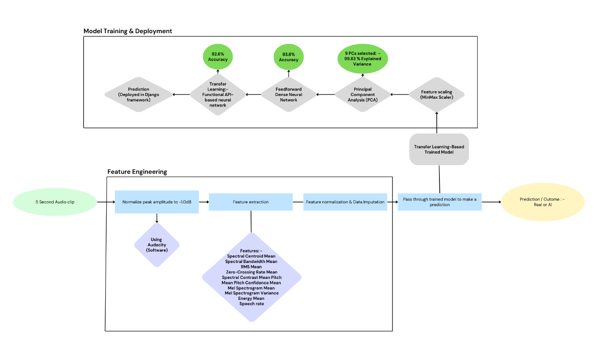
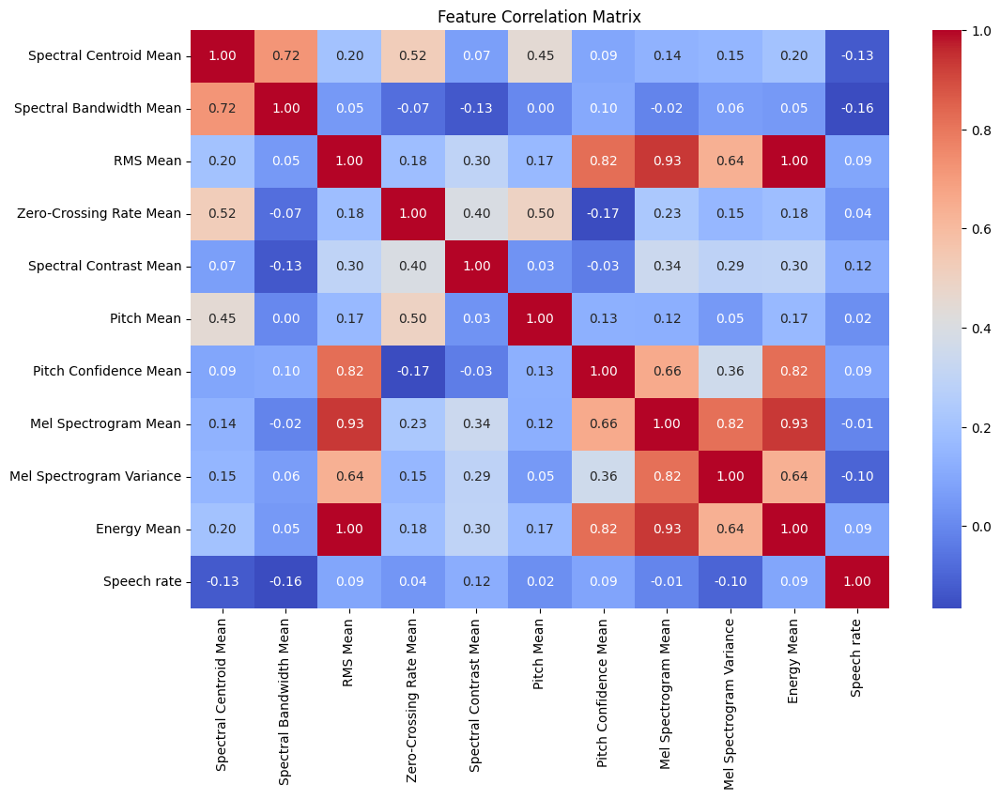
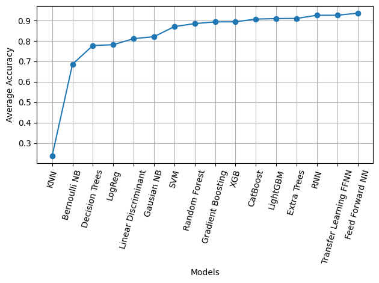

# 🏆🎙️ WaveTruth: AI-Generated Voice Detection & Gender Classification  

📄 [**Full Detailed Research Report (PDF)**](https://github.com/hishamikoo/Deepfake-AI-Detection/blob/main/Research%20Paper%20-%20WaveTruth.pdf)  

📊🎧 The raw audio clips dataset used for this project is available on [**Google Drive**](https://drive.google.com/drive/u/0/folders/1joD1gSSAzIXuPOoOuYL1Tn-WiEehtvMY).  

📊 The feature-extracted dataset in Excel format is available in the [**audio_dataset folder**](./dataset/) under the main branch.  

---

## 📌 Overview  
The rapid advancement of artificial intelligence in speech synthesis has led to an increase in AI-generated voices that closely mimic human speech. **WaveTruth** is a deep learning-based system designed to:  
- 🎭 **Detect AI-generated voices** vs. **real human voices**  
- 🚻 **Classify gender** (male/female) of both AI-generated and real voices  
- 🌐 Provide an **interactive web application** for real-time voice detection  

This project uses **Transfer Learning with Feedforward Neural Networks (FFNN)** to achieve state-of-the-art accuracy in deepfake speech detection.  

  

---

## 🔥 Project Features  
✅ **Custom Dataset**: 1,956 audio clips (~2.7 hours) covering real and AI-generated voices from diverse accents (Canadian, Australian, Indian, American, English, European, and African).  
✅ **Deep Learning Models**: Comparison of 16 machine learning and deep learning models, with FFNN outperforming traditional models.  
✅ **Web App Deployment**: A Django-based application providing real-time audio classification.  
✅ **Feature Extraction**: Utilizes spectral, energy, pitch, and temporal features for robust speech analysis.  

### 📌 Practical Applications  
- ✅ Fake audio detection in journalism & social media.  
- ✅ Deepfake threat detection in security.  
- ✅ AI-generated content filtering.  
- ✅ Voice biometrics & authentication.  

  

---

## 📊 Dataset & Processing  
1. **Data Collection**: Real voices sourced from podcasts, speeches, and lectures; AI voices generated using various TTS models.  
2. **Preprocessing**:  
   - 🎵 Audio split into 5-second clips.  
   - 🎛️ Normalization to a fixed decibel level.  
   - 📊 Feature extraction: Spectral centroid, bandwidth, contrast, pitch mean, Mel spectrogram, speech rate, and more.
   - MinMax Scaling of Extracted Features.
   - Principal Compnent Analyisis.

  

---

## 🎯 Results & Key Findings  
- 🚨 Traditional models like **kNN and Naïve Bayes** struggled with complex audio features.  
- 🌳 **Tree-based models (Random Forest, XGBoost, CatBoost)** performed significantly better (75%-90% accuracy).  
- 🤖 **Deep learning models (FFNN, RNN)** outperformed traditional methods, with **Transfer Learning FFNN achieving the maximum generalization**.  
- 🚻 Gender classification was successfully integrated, improving the model's practical applications.  

  

---

## 🔍 Model Selection & Performance  
A comparative analysis of machine learning and deep learning models was conducted:  

📌 **Traditional Models**: kNN, Naïve Bayes, Decision Trees, Logistic Regression, SVM, Random Forest, XGBoost, CatBoost, etc.  
📌 **Deep Learning Models**: Feedforward Neural Networks (FFNN), Recurrent Neural Networks (RNN), Transfer Learning-based FFNN.  
📌 **Selected Model**: **Transfer Learning Based Deep Learning models** outperformed all others in terms of generalization, achieving **90%+ accuracy** in distinguishing AI-generated vs. real voices.  

---

## 🌐 Web Application  
WaveTruth is deployed as a **Django-based web application**, allowing users to:  
🎵 Upload an audio file.  
🧠 Get real-time predictions on whether the voice is AI-generated or real.  
🚻 Determine the gender of the speaker.  

---

## 🚀 Installation & Usage  
### 📌 Prerequisites  
- Python 3.8+  
- TensorFlow  
- Django  
- Librosa (for audio processing)  
- NumPy, Pandas, Matplotlib & Seaborn (for analysis)  
- scikit-learn  
- LabelEncoder and OneHotEncoder (for categorical feature encoding)  
- Dense, Dropout, BatchNormalization, and Activation layers  
- Optimizers - Adam, SGD, RMSprop, Adagrad  
- Sequential and Functional API models  

---

## 🔮 Future Improvements  
🔹 Expand dataset with more diverse voices and languages.  
🔹 Enhance real-time processing for faster classification.  
🔹 Optimize the model for mobile and embedded systems.  

---

## 🤝 Contributing  
Pull requests and feature suggestions are welcome! Feel free to open an issue or contribute to improving **WaveTruth**.  

---

## 📜 License  
This project is licensed under the MIT License. See `LICENSE` for details.  

---

## 📧 Contact  
For questions or collaborations, contact **Hisham Iqbal Khokhar** at **hishamjavaid2@gmail.com**.  
